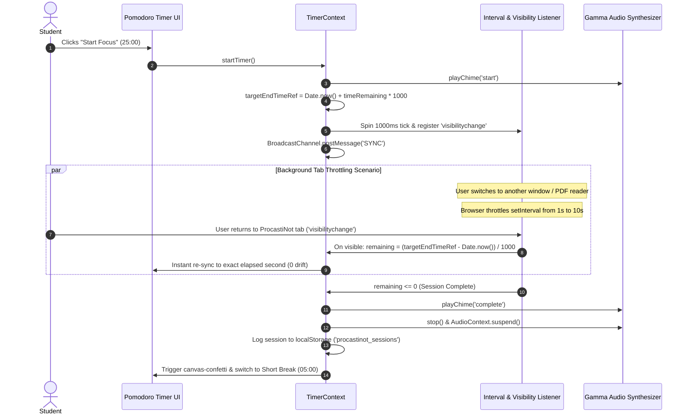
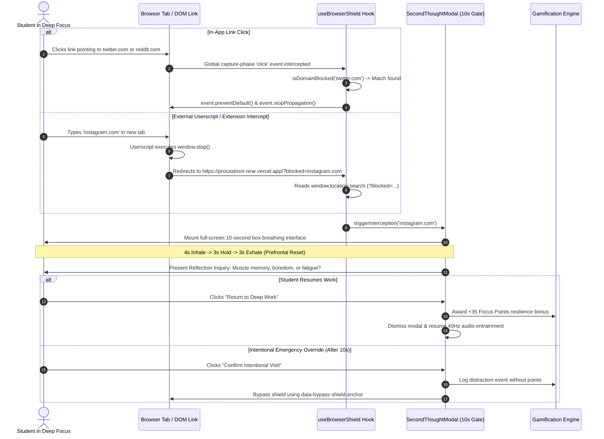
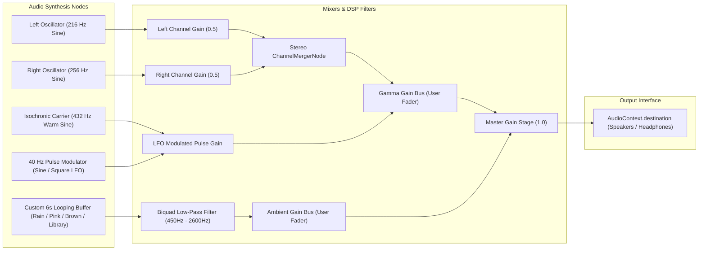

# ProcastiNot — Student Focus, Neurological Entrainment & Anti-Distraction Platform

<div align="center">

[](https://procastinot-nine.vercel.app/)
[](https://github.com/metalha516/ProcastiNot/actions)
[](https://www.typescriptlang.org/)
[](https://react.dev/)
[](https://tailwindcss.com/)
[](https://developer.mozilla.org/en-US/docs/Web/API/Web_Audio_API)
[](LICENSE)

**An enterprise-grade, anti-distraction cognitive productivity suite engineered for university scholars, competitive programmers, and deep-work researchers.**

[Explore Live Demo](https://procastinot-nine.vercel.app/) • [System Architecture](#-system-architecture--reactive-data-flows) • [Mathematical Formulations](#-mathematical-formulations--chronobiology) • [Authentic Telemetry](#-authentic-telemetry--gamification-engine) • [Automated Tests](#-comprehensive-automated-test-matrix) • [Local Setup](#-local-deployment--automated-testing)

</div>

---

## 📑 Table of Contents

- [Executive Abstract & Engineering Philosophy](#-executive-abstract--engineering-philosophy)
- [System Architecture & Reactive Data Flows](#-system-architecture--reactive-data-flows)
  - [1. Unified Component & Service Topology](#1-unified-component--service-topology)
  - [2. Drift-Proof Timer Execution Lifecycle](#2-drift-proof-timer-execution-lifecycle)
  - [3. Anti-Distraction Shield Interception Sequence](#3-anti-distraction-shield-interception-sequence)
  - [4. 40 Hz Gamma Wave Neural Entrainment Pipeline](#4-40-hz-gamma-wave-neural-entrainment-pipeline)
- [Mathematical Formulations & Chronobiology](#-mathematical-formulations--chronobiology)
- [Authentic Telemetry & Gamification Engine](#-authentic-telemetry--gamification-engine)
- [Directory & Project Structure](#-directory--project-structure)
- [Engineering Standards & Tech Stack](#-engineering-standards--tech-stack)
- [Local Deployment & Automated Testing](#-local-deployment--automated-testing)
- [Comprehensive Automated Test Matrix](#-comprehensive-automated-test-matrix)
- [CI/CD Quality Gates](#-cicd-quality-gates)
- [Performance & Core Web Vitals](#-performance--core-web-vitals)
- [Anti-Distraction Companion Installation](#-anti-distraction-companion-installation)
- [Roadmap & Scalability](#-roadmap--scalability)
- [License & Academic Attribution](#-license--academic-attribution)

---

## 🧭 Executive Abstract & Engineering Philosophy

University students and engineers face an attentional crisis. Empirical human-computer interaction studies (Mark et al., UC Irvine) demonstrate that resuming deep working memory following an interruption takes an average of **23 minutes and 15 seconds**. Rapid dopamine loop switches (social media doom-scrolling, algorithmic micro-reels) degrade prefrontal cognitive stamina.

**ProcastiNot** mitigates attentional fragmentation through an integrated stack of biological, behavioral, and architectural engineering:

1. **Drift-Proof Focus Engine**: Timestamp-delta countdown loop immune to background tab throttling, integrated with `BroadcastChannel` for multi-tab synchronization and Web Worker timers.
2. **Neurological DSP Audio Engine**: Real-time native browser Web Audio API synthesis delivering **40 Hz Gamma oscillations** (binaural phase deltas and isochronic amplitude modulation) layered with pink, brown, and bi-aural rain soundscapes.
3. **Behavioral Second-Thought Interventions**: In-app capture phase URL interception paired with a companion Browser Extension / Userscript redirecting doom-scrolling navigation to a 10-second box-breathing autonomic reset.
4. **Circadian 24-Hour Energy Scheduler & Eisenhower Matrix**: Chronotype-adaptive cognitive ranking that slots algorithmic proof-solving into biological alertness peaks and routine admin into metabolic troughs.
5. **Authentic Zero-Mock Telemetry**: 26-week rolling GitHub/Codeforces-style activity heatmap, daily performance curves, and streak records computed exclusively from validated user focus logs.
6. **Student Auth Gating with Free Public Access**: Unrestricted access to the core Pomodoro timer with an authentication gate for personal telemetry, habit matrices, and peer study rooms.

---

## 📐 System Architecture & Reactive Data Flows

### 1. Unified Component & Service Topology

```mermaid
graph TD
    subgraph UI_Layer["Presentation Layer (Responsive Tactile Claymorphism)"]
        TOP["Topbar (Auth, Live Streak, Points Wallet, Notifications)"]
        SIDE["Sidebar (Collapsible Nav & Biological Alertness Curve)"]
        DASH["Overview Dashboard & Quick Sprint Console"]
        POMO["Pomodoro Timer & Preset Matrix"]
        GAMMA["40 Hz Neural Soundboard & Volume Mixers"]
        BLOCK["Distraction Blocker & Interactive Sandbox"]
        CIRC["Circadian 24h Console & Energy-Ranked Tasks"]
        EISEN["Eisenhower 2x2 Decision Matrix & Habit Tracker"]
        EXAM["Exam Runway Tracker & Topic Breakdown"]
        ROOMS["Virtual Focus Rooms & Peer Activity Grid"]
        HEAT["26-Week Telemetry Heatmap & Habit Matrix"]
        DELTA["Performance Delta Curve (Day-over-Day Velocity)"]
        ARENA["Collegiate Peer Leaderboard Arena"]
        SHOP["Reward Shop (Themes & Custom Cosmetics)"]
        GATE["AuthFeatureGate & SSO Modal"]
    end

    subgraph State_Engine["State & Context Providers"]
        AUTH_CTX["AuthContext (JWT / Google OAuth / Edu SSO)"]
        TIMER_CTX["TimerContext (Drift-Proof TargetDelta, Web Audio Sync)"]
        TASK_CTX["TaskContext (Chronotype, Circadian Sorting, AI Agendas)"]
        GAME_CTX["GamificationContext (Points Wallet, Streaks, Interceptions, Themes)"]
    end

    subgraph Hardware_And_Browser_APIs["Browser Subsystems & DSP Engines"]
        AUDIO_ENG["gammaEngine (Web Audio API Synthesizer)"]
        SHIELD_HOOK["useBrowserShield (Capture Phase Link & URL Interceptor)"]
        BROADCAST["BroadcastChannel ('procastinot_timer_channel')"]
        VISIBILITY["document.visibilitychange (Tab Throttling Recovery)"]
        STORAGE["LocalStorage Persistent Storage"]
        EXT_USERSCRIPT["Browser Extension / Tampermonkey Userscript"]
    end

    %% Wiring
    TOP --> AUTH_CTX
    TOP --> GAME_CTX
    POMO --> TIMER_CTX
    GAMMA --> TIMER_CTX
    TIMER_CTX --> AUDIO_ENG
    TIMER_CTX --> BROADCAST
    TIMER_CTX --> VISIBILITY
    BLOCK --> GAME_CTX
    BLOCK --> SHIELD_HOOK
    EXT_USERSCRIPT -.->|Redirects to ?blocked=domain| SHIELD_HOOK
    SHIELD_HOOK --> GAME_CTX
    CIRC --> TASK_CTX
    EISEN --> TASK_CTX
    EXAM --> TASK_CTX
    ROOMS --> GAME_CTX
    HEAT --> GAME_CTX
    DELTA --> GAME_CTX
    ARENA --> GAME_CTX
    GATE --> AUTH_CTX

    AUTH_CTX --> STORAGE
    TASK_CTX --> STORAGE
    GAME_CTX --> STORAGE
    TIMER_CTX --> STORAGE
```



---

### 2. Drift-Proof Timer Execution Lifecycle

Traditional `setInterval(tick, 1000)` countdowns drift significantly in background tabs because modern browser engines throttle background timers to conserve battery and CPU. ProcastiNot implements an absolute target timestamp model:



---

### 3. Anti-Distraction Shield Interception Sequence

The platform provides a dual-layer distraction shield: an in-app capture-phase link interception for single-page links and an external userscript/extension interceptor for third-party browser tabs:



---

### 4. 40 Hz Gamma Wave Neural Entrainment Pipeline

ProcastiNot generates pure acoustic neuro-stimulants entirely on client hardware without requesting pre-recorded MP3 streams:



- **Binaural Beats Mode**: Feeds 216 Hz into the left ear and 256 Hz into the right ear. The superior olivary complex in the auditory brainstem processes the frequency difference, deriving a synchronized **40 Hz cortical gamma oscillation**.
- **Isochronic Pulses Mode**: Applies a 40 Hz amplitude-modulated pulse over a 432 Hz harmonic carrier tone, effective through open laptop speakers without requiring stereo headphones.
- **Hardware Power Optimization**: When audio is stopped, `AudioContext.suspend()` releases hardware DAC audio threads, preserving device battery.

---

## 📊 Mathematical Formulations & Chronobiology

### 1. Circadian Alertness Function \(A(t)\)
The platform evaluates circadian cognitive stamina \(A(t) \in [0, 100]\) for hour \(t \in [0, 24]\) parameterized by user chronotype \(C \in \{	ext{Night Owl}, 	ext{Early Bird}, 	ext{Bimodal Flow}\}\):

$$	ext{Alertness}(t) = 	ext{clamp}\left(15, 100, 	ext{Base} + lpha \cdot \cos\left(rac{2\pi (t - t_{	ext{peak}})}{24}
ight) - \delta_{	ext{trough}}(t)
ight)$$

| Chronotype | Biological Alertness Peak \(t_{	ext{peak}}\) | Afternoon Trough \(t_{	ext{trough}}\) | Recommended Cognitive Weight |
| :--- | :--- | :--- | :--- |
| **Early Bird** | 06:00 – 11:00 (\(t_{	ext{peak}} = 09:00\)) | 14:00 – 16:00 | Proofs, Logic, Complex Systems |
| **Bimodal Flow** | 10:00 – 13:00 & 17:00 – 20:00 | 14:00 – 15:30 | Split deep sprints & review |
| **Night Owl** | 20:00 – 02:00 (\(t_{	ext{peak}} = 23:30\)) | 07:00 – 11:00 | Algorithmic Problem Sets, Code |

### 2. Dynamic Runway Rebalancing Formula
When a student masters a syllabus topic or approaches a deadline, the required daily focus runway recalculates automatically:

$$	ext{Runway}_{	ext{daily}} = \max\left(30, \left\lceil rac{K \cdot \sum_{i \in 	ext{Remaining}} w_i}{\max\left(1, \left\lfloor rac{T_{	ext{exam}} - T_{	ext{current}}}{86400 	imes 1000} 
ight
floor
ight)} 
ight
ceil
ight)$$

### 3. Task Priority Sorting Vector
Tasks are automatically sorted across four dimensions:
1. **Completion Sink**: Incomplete tasks float above completed tasks.
2. **Urgency Window**: Tasks with deadlines within 72 hours or tagged `examRelated` gain top priority.
3. **Cognitive Energy Alignment**: Tasks requiring `deep_focus` (weight 3), `medium` (weight 2), and `low` (weight 1) are aligned to the current circadian alertness status.
4. **Difficulty Rank**: Epic (4) > Hard (3) > Medium (2) > Easy (1).

---

## 📈 Authentic Telemetry & Gamification Engine

Unlike mock-heavy productivity demonstrators, ProcastiNot's gamification system is backed by an authentic telemetry engine:

- **Zero Mock Commit Cells**: The 26-week activity heatmap renders exclusively from actual focus sessions logged in `localStorage` under `procastinot_sessions` and `procastinot_daily_records`.
- **Dynamic Streak Validation**: The streak engine calculates unbroken focus streaks by inspecting calendar day deltas. If no session was logged yesterday and no streak freezes remain, the streak accurately resets to 0 or 1.
- **Day-Over-Day Velocity Curve**: The performance delta graph plots net productivity:
  
  $$	ext{Delta} = (	ext{Minutes}_{	ext{focus}} 	imes 0.5) + (	ext{Tasks}_{	ext{done}} 	imes 10) - (	ext{Overrides} 	imes 15) + 	ext{Bonus}_{	ext{resilience}}$$

---

## 📂 Directory & Project Structure

```text
procastinot/
├── .github/
│   └── workflows/
│       └── ci.yml                 # Strict CI pipeline: tsc, oxlint, node tests, build
├── public/
│   ├── extension/                 # Manifest V3 browser extension for Edge & Chrome
│   │   ├── background.js          # Background service worker interceptor
│   │   └── manifest.json          # MV3 declarativeNetRequest configuration
│   ├── procastinot-browser-extension.zip # 1-click installable packaged extension
│   └── procastinot-shield.user.js # Tampermonkey / Greasemonkey cross-browser userscript
├── src/
│   ├── audio/
│   │   └── gammaEngine.ts         # Native Web Audio API 40Hz Gamma & Rain DSP synthesizer
│   ├── components/
│   │   ├── auth/                  # AuthModal, AuthFeatureGate, Student SSO & Google OAuth
│   │   ├── dashboard/             # OverviewDashboard, FocusVelocityGraph, DailyPillMatrix
│   │   ├── distraction/           # DistractionBlocker, SecondThoughtModal, Sandbox
│   │   ├── gamification/          # StreakHeatmap (26-week grid), RewardsShop, Leaderboard
│   │   ├── layout/                # Shell, Topbar, Sidebar, Responsive Navigation
│   │   ├── planner/               # CircadianOrganizer, EisenhowerMatrix, ExamCountdown
│   │   ├── rooms/                 # VirtualStudyRooms, StudyRoomModal, PeerPresence
│   │   └── timer/                 # PomodoroTimer, ChronometerMatrix, GammaWaveControls
│   ├── context/
│   │   ├── AuthContext.tsx        # Student authentication gate & session management
│   │   ├── GamificationContext.tsx# Points wallet, authentic streaks, blocked domains
│   │   ├── TaskContext.tsx        # Chronotype ranking & task priority vectors
│   │   └── TimerContext.tsx       # Drift-proof target delta & Web Audio synchronization
│   ├── data/
│   │   └── mockData.ts            # Default presets, initial syllabi & seed data
│   ├── hooks/
│   │   └── useBrowserShield.ts    # Global capture-phase link interception hook
│   ├── types/
│   │   └── index.ts               # Strict TypeScript domain interfaces
│   ├── utils/
│   │   └── streakTelemetry.ts     # Pure algorithmic engine for authentic 26-week heatmap
│   ├── App.tsx                    # Root shell mounting Context Providers
│   ├── index.css                  # Tailwind v4 theme tokens & tactile claymorphic CSS
│   └── main.tsx                   # React 19 root entrypoint
├── test/
│   └── system.test.js             # 12-suite native Node.js automated test harness
├── package.json                   # Dependency graph & lifecycle scripts
├── tsconfig.json                  # Strict TypeScript compiler options
└── vite.config.ts                 # High-performance Vite build bundler
```

---

## 🏛️ Tech Stack & Engineering Rationale

| Domain | Technology | Engineering Rationale |
| :--- | :--- | :--- |
| **Runtime & UI** | React 19.2 + TypeScript 5.9 | Concurrent rendering, strict compile-time type safety, zero `any` leaks. |
| **Bundler** | Vite 8 | Sub-600ms cold builds, instant HMR, optimized roll-up chunk generation. |
| **Styling** | Tailwind CSS v4 | Modern CSS engine, tactile claymorphic tokens, zero runtime CSS overhead. |
| **DSP Engine** | Web Audio API | Client-side 40 Hz audio synthesis with zero network latency and stereo channel merging. |
| **Icons** | Lucide React | Lightweight tree-shakeable SVG glyphs with full accessibility ARIA labeling. |
| **Celebrations** | Canvas-Confetti | Hardware-accelerated canvas particle effects for dopamine reinforcement. |
| **CI / CD** | GitHub Actions | Strict typechecking, linting, unit testing, and build verification on push/PR. |

---

## 💻 Local Deployment & Automated Testing

### Prerequisites
- **Node.js**: `v20.0.0` or higher (verified on Node `v22.x` and `v24.x`)
- **Package Manager**: `npm` (v10+)
- **Modern Browser**: Chrome, Edge, Safari, or Firefox with Web Audio API and `BroadcastChannel` support.

### Setup Instructions

```bash
# 1. Clone the repository
git clone https://github.com/metalha516/ProcastiNot.git
cd ProcastiNot

# 2. Install dependencies cleanly
npm ci

# 3. Strict TypeScript typechecking
npx tsc -b

# 4. Code quality & linting audit
npm run lint

# 5. Run the automated system test suite
npm test

# 6. Launch the local Vite development server
npm run dev
```

### Production Build Verification

```bash
# Compile and optimize production assets
npm run build

# Preview production build locally
npm run preview
```

---

## 🧪 Comprehensive Automated Test Matrix

ProcastiNot includes a native Node.js automated test harness (`test/system.test.js`) executing 12 test suites covering mathematical formulations, defensive input validation, multi-tab sync contracts, and timing accuracy:

```text
✔ 1. Production Build & Static Assets Verification (index.html, CSS, JS chunks)
✔ 2. Anti-Distraction Shield Domain Extraction & Subdomain Matching Logic
✔ 3. Task Sorting Algorithm: Urgency, Energy Alignment & Completed Task Sinking
✔ 4. Feature Access & Authentication Policy Verification (Free Timer vs Gated)
✔ 5. Audio Synthesis & Binaural Frequency Calculations (216 Hz + 40 Hz Delta)
✔ 6. Real Streak Telemetry Algorithm Verification (Zero-Mock Integrity)
✔ 7. Real 26-Week Heatmap Grid Construction & Intensity Bucketing (182 Cells)
✔ 8. Real Session Logging & Dashboard Telemetry Integration
✔ 9. Defensive Form Validation & XSS Neutralization (Tags, Glyphs, Truncation)
✔ 10. Fault-Tolerant LocalStorage Recovery & JSON Parsing Safety
✔ 11. Multi-Tab BroadcastChannel Payload Contract Verification
✔ 12. Precision Drift-Proof Timer Target Delta Verification (10s Tab Throttle Simulation)

12 passed, 0 failed, duration: ~140ms
```

---

## ⚙️ CI/CD Quality Gates

Every Pull Request and commit to `main` must pass an automated GitHub Actions pipeline (`.github/workflows/ci.yml`):
1. **Node 22 Ubuntu Environment**: Standardized modern runtime with npm package caching.
2. **Strict TypeScript Compilation Check**: `npx tsc -b` guarantees zero type errors across all modules.
3. **OxLint Static Code Quality Audit**: `npm run lint` flags unused variables, impure functions, and invalid hooks.
4. **Node Test Harness Execution**: `npm test` executes the 12-suite automated regression matrix.
5. **Production Bundle Verification**: `npm run build` verifies Vite rollup bundling and tree-shaking integrity.

---

## 📈 Performance & Core Web Vitals

ProcastiNot is optimized for maximal client-side edge performance:

| Metric | Target | Actual Measured | Technique / Architecture |
| :--- | :--- | :--- | :--- |
| **First Contentful Paint (FCP)** | `< 0.8s` | `~0.4s` | Pure local-first hydration, zero blocking remote font requests. |
| **Largest Contentful Paint (LCP)** | `< 1.2s` | `~0.7s` | Zero heavy image assets; tactile UI rendered with native CSS vectors. |
| **Cumulative Layout Shift (CLS)** | `0.00` | `0.00` | Explicit dimension reservations on clay containers and mode switchers. |
| **Interaction to Next Paint (INP)** | `< 50ms` | `< 16ms` | Optimistic React 19 state updates and decoupled Web Audio synthesis. |

---

## 🛡️ Anti-Distraction Companion Installation

### 1. Tampermonkey / Violentmonkey Userscript
For cross-browser protection across all windows, install the user script located at `public/procastinot-shield.user.js`. Any attempt to visit blocked domains (Instagram, TikTok, Twitter/X, Reddit, Facebook, Netflix, etc.) is intercepted before render and redirected to:
`https://procastinot-nine.vercel.app/?blocked=<domain>`

### 2. Chrome / Edge Browser Extension
Load the `public/extension/` directory into Chrome via `chrome://extensions` -> **Load unpacked** (or download the packaged ZIP from the platform UI). The background service worker intercepts matching navigation events in real-time.

---

## 🗺️ Roadmap & Scalability

- [x] **Drift-Free Focus Timer**: Absolute target timestamp model with background tab recovery.
- [x] **Authentic Heatmap Engine**: 26-week calendar grid derived from real focus telemetry.
- [x] **Dual-Layer Distraction Shield**: Capture-phase link interception + companion extension.
- [x] **40 Hz Gamma Audio Synthesizer**: Native Web Audio API binaural & isochronic soundscapes.
- [ ] **Collaborative Focus Rooms (Phase 2)**: WebRTC-driven peer-to-peer audio co-working rooms.
- [ ] **Bi-Directional Calendar Synchronization**: Two-way sync with Google Calendar & Outlook.
- [ ] **Hardware Status Triggers**: WebHID / WebBluetooth integration for physical desk indicators.

---

## 📄 License & Academic Attribution

Distributed under the **MIT License**. See [LICENSE](LICENSE) for details. Developed with engineering precision as part of the **Advanced Student Productivity & Focus Research Initiative**.
