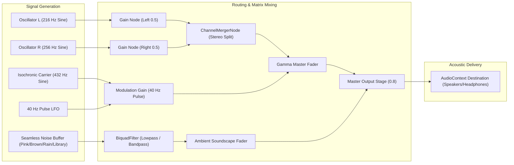

# ProcastiNot (OmniFocus / StudyForge)

<div align="center">


**Intelligent, Anti-Distraction Student Productivity & Focus Ecosystem**  
*Engineered for University Scholars, Competitive Programmers, and Self-Paced Researchers.*  
*Designed following the **Google Stitch Design Language** (`#121316` / `#191a1f` Onyx, Glassmorphism, Responsive Shell).*

[Live Repository](https://github.com/metalha516/ProcastiNot.git) • [System Architecture](#-system-architecture--schematics) • [Directory Structure](#-detailed-project-structure) • [Cognitive Formulations](#-mathematical-models--cognitive-ergonomics) • [Getting Started](#-local-deployment--getting-started)

</div>

---

## 📖 Executive Abstract & Pedagogical Significance

Modern higher education is characterized by acute attentional fragmentation. Psychological studies (Gloria Mark et al.) demonstrate that it takes an average of **23 minutes and 15 seconds** to return to deep working memory focus after an external interruption or digital doom-scrolling context switch.

**ProcastiNot** (OmniFocus / StudyForge) addresses this crisis through a four-pillar cognitive ergonomics framework:

1. **Neurological Entrainment**: In-browser real-time synthesis of **40 Hz Gamma oscillations** and colored soundscapes to support prefrontal cortical phase-locking.
2. **Behavioral Second-Thought Interventions**: Full-screen doom-scrolling friction challenges featuring a 10-second box-breathing cycle to decouple autonomic dopamine seeking reflex.
3. **Chronobiological Alignment**: Circadian alertness scheduling matching task cognitive weight (`deep_focus`, `medium`, `low`) against user biological chronotypes (**Night Owl**, **Early Bird**, **Bimodal Flow**).
4. **Multiplayer Accountability & Gamification**: Synchronized virtual study rooms, Codeforces-style 365-day consistency heatmaps, and a **Daily Performance Delta Curve** measuring daily focus velocity.

---

## 📐 System Architecture & Schematics

### 1. High-Level Modular System Architecture
The application adheres to a unidirectional reactive data-flow architecture layered cleanly across UI presentations, state contexts, browser hardware interfaces, and audio synthesizers:

```mermaid
graph TD
    subgraph UI_Presentation["Presentation Layer (Google Stitch Theme)"]
        TOP["Topbar (Streaks, Points Wallet, Notifications)"]
        SIDE["Sidebar (Collapsible Nav & Bio-Alertness Monitor)"]
        DASH["Overview Dashboard & Quick Sprint Hub"]
        TIMER_UI["Pomodoro SVG Ring & Preset Matrix"]
        BLOCK_UI["Distraction Interceptor & Sandbox"]
        CIRC_UI["Circadian 24h Alertness Curve & Task Organizer"]
        PLAN_UI["AI Study Runway & Exam Countdown Cards"]
        ROOM_UI["Multiplayer Virtual Focus Rooms & Peer Tiles"]
        GAME_UI["365-Day Consistency Heatmap & Delta Trends"]
        SHOP_UI["Theme & Badge Reward Shop"]
        MODAL_UI["Second-Thought Friction Modal & Auth Shell"]
    end

    subgraph State_Engine["Reactive Context & Service Layer"]
        AUTH_CTX["AuthContext (JWT / Google OAuth / Edu SSO)"]
        TIMER_CTX["TimerContext (Countdown, Presets, Sync)"]
        TASK_CTX["TaskContext (Chronotype, Circadian Evaluator, AI Agendas)"]
        GAME_CTX["GamificationContext (Points Wallet, Streaks, Interceptions, Themes)"]
    end

    subgraph Core_Engines["Hardware & Subsystem Controllers"]
        AUDIO_ENG["Web Audio API 40 Hz Gamma Synthesizer (Binaural & Isochronic)"]
        INTERCEPT_ENG["Network Domain Interceptor & Friction Simulator"]
        AI_RUNWAY["Runway Balancer & Syllabus Spaced-Repetition Model"]
        BROADCAST["BroadcastChannel (Cross-Tab Realtime Synchronization)"]
        STORAGE["LocalStorage Persistent Telemetry & Store"]
    end

    %% Wiring
    TOP --> AUTH_CTX
    TOP --> GAME_CTX
    TIMER_UI --> TIMER_CTX
    TIMER_CTX --> AUDIO_ENG
    TIMER_CTX --> BROADCAST
    BLOCK_UI --> GAME_CTX
    BLOCK_UI --> INTERCEPT_ENG
    INTERCEPT_ENG --> MODAL_UI
    CIRC_UI --> TASK_CTX
    PLAN_UI --> TASK_CTX
    TASK_CTX --> AI_RUNWAY
    ROOM_UI --> GAME_CTX
    GAME_UI --> GAME_CTX
    SHOP_UI --> GAME_CTX

    AUTH_CTX --> STORAGE
    TASK_CTX --> STORAGE
    GAME_CTX --> STORAGE
    TIMER_CTX --> STORAGE
```



---

### 2. "Second-Thought" Anti-Distraction Behavioral State Machine
When a student triggers an impulse to visit a restricted domain (e.g. Instagram, TikTok, YouTube Shorts), the system intercepts the event and executes a prefrontal restorative sequence:

```mermaid
sequenceDiagram
    autonumber
    actor Student as Student (In Focus Sprint)
    participant Engine as Interceptor Engine
    participant Modal as Second-Thought Friction Modal
    participant Audio as Web Audio Synthesizer
    participant Wallet as Focus Points Wallet

    Student->>Engine: Attempts visit to restricted domain (e.g., instagram.com)
    Engine->>Modal: Intercept navigation & mount full-screen friction gate
    Engine->>Audio: Play 432 Hz mindfulness singing bowl chime
    Modal->>Student: Display 10-second Box-Breathing Ring (Inhale... Hold... Exhale)
    Note over Modal,Student: Prefrontal cortex activates; dopamine urge subsides
    Modal->>Student: Present Reflection Query (Muscle memory, boredom, fatigue, or search?)
    alt Student Chooses "Return to Deep Work"
        Student->>Modal: Clicks "Return to Deep Work" CTA
        Modal->>Audio: Play victorious completion chime chord
        Modal->>Wallet: Award +35 Focus Resilience Points & trigger celebratory confetti
        Modal->>Engine: Log 15 minutes saved & increment daily performance index
        Modal-->>Student: Resume synchronized timer with 40 Hz entrainment
    else Intentional Bypass Requested (After 10s cooldown)
        Student->>Modal: Clicks "I genuinely need this domain"
        Modal->>Wallet: Log distraction attempt without reward points
        Modal-->>Student: Allow navigation while logging anti-focus telemetry
    end
```

---

### 3. Web Audio 40 Hz Gamma Entrainment Pipeline
The neural audio engine utilizes the native browser `AudioContext` to construct dual carrier frequencies without external audio dependencies:



---

## 🗂️ Detailed Project Structure

```
d:/Procastinot/
├── index.html                     # Entry HTML configured with Google Stitch typography & meta tags
├── package.json                   # Dependency tree (React 19, Vite 8, Tailwind v4, Lucide, Confetti)
├── package-lock.json              # Deterministic lockfile
├── tsconfig.json                  # Root TypeScript project reference configuration
├── tsconfig.app.json              # Application compiler options (ES2023, Bundler, DOM.Iterable)
├── tsconfig.node.json             # Vite tooling compiler configuration
├── vite.config.ts                 # Vite pipeline configured with React and @tailwindcss/vite
├── .oxlintrc.json                 # Oxlint static analysis rules
├── .gitignore                     # Git ignore rules for node_modules, dist, and artifacts
├── README.md                      # Comprehensive academic & engineering documentation
│
├── public/
│   ├── favicon.svg                # Dynamic SVG favicon
│   └── icons.svg                  # SVG symbol sprite definitions
│
└── src/
    ├── main.tsx                   # React DOM root bootstrapping & strict mode mounting
    ├── App.tsx                    # Root provider composition (Auth, Task, Gamification, Timer)
    ├── index.css                  # Tailwind CSS v4 styling, custom scrollbars, animations, theme tokens
    │
    ├── types/                     # Strict TypeScript Data Contracts
    │   └── index.ts               # UserProfile, Task, ExamDeadline, VirtualRoom, HeatmapDay, Themes
    │
    ├── audio/                     # Neurological Audio Engine
    │   └── gammaEngine.ts         # Real-time Web Audio 40Hz binaural/isochronic synthesizer & soundscapes
    │
    ├── data/                      # Fixtures & Initial Seed State
    │   └── mockData.ts            # Collegiate seed data (Stanford/MIT scholars, courses, rooms, shop)
    │
    ├── context/                   # Reactive Global State Managers
    │   ├── AuthContext.tsx        # Session management, Google OAuth simulation, Institutional SSO
    │   ├── TimerContext.tsx       # Pomodoro countdown, BroadcastChannel multi-tab sync, title ticker
    │   ├── TaskContext.tsx        # Chronotype evaluation, circadian alertness engine, AI runway balancer
    │   └── GamificationContext.tsx# FP wallet, streak shields, 365d heatmap, delta curve, blocker sandbox
    │
    └── components/                # Modular UI Architecture
        ├── layout/
        │   ├── Topbar.tsx         # Streak flame counter, FP wallet, routine-aware notification bell
        │   ├── Sidebar.tsx        # Collapsible navigation, section groupings, bio-alertness status
        │   └── Shell.tsx          # Master shell with responsive drawer and active view dispatcher
        │
        ├── dashboard/
        │   └── OverviewDashboard.tsx # Unified command center with urgent runway, task queue, and quick sprint
        │
        ├── timer/
        │   ├── PomodoroTimer.tsx     # SVG gradient progress ring, preset chips, task binding
        │   └── GammaWaveControls.tsx # 40Hz mode switcher, dual volume faders, frequency visualizer
        │
        ├── distraction/
        │   ├── DistractionBlocker.tsx    # Blacklist CRUD, category filters, interactive test sandbox
        │   └── SecondThoughtModal.tsx    # 10s box-breathing friction challenge, reflection inquiry, +35 FP
        │
        ├── planner/
        │   ├── CircadianOrganizer.tsx # 24h biological alertness curve, chronotype switch, cognitive tags
        │   ├── AIStudyPlanner.tsx     # Syllabus parameter ingestion, spaced-repetition runway generator
        │   └── ExamCountdown.tsx      # Ticking countdowns (D/H/M/S), syllabus checklist, auto-rebalance
        │
        ├── rooms/
        │   └── VirtualFocusRooms.tsx  # Multiplayer focus rooms, peer cards, quiet cheers, synced timer
        │
        ├── gamification/
        │   ├── StreakHeatmap.tsx         # 365-day Codeforces/GitHub square commit matrix with freeze shields
        │   ├── PerformanceDeltaCurve.tsx # Interactive SVG trend spline displaying day-over-day focus deltas
        │   ├── LeaderboardArena.tsx      # Collegiate rankings (Stanford, MIT, Berkeley) and cohort comparison
        │   └── RewardShop.tsx            # Redeemable themes (Stitch, Cyberpunk, Emerald, Solar) & badges
        │
        └── auth/
            └── AuthModal.tsx          # Email/pass, Google OAuth, and Stanford/MIT/Harvard/Berkeley SSO
```

---

## 📊 Mathematical Models & Cognitive Ergonomics

### 1. Circadian Alertness Function \(A(t)\)
Alertness score \(A(t) \in [0, 100]\) as a function of hour of the day \(t \in [0, 24]\) parameterized by user chronotype \(C \in \{\text{Night Owl}, \text{Early Bird}, \text{Bimodal Flow}\}\):

$$\text{Alertness}(t) = \text{base} + \alpha \cdot \cos\left(\frac{2\pi (t - t_{\text{peak}})}{24}\right) - \delta_{\text{trough}}(t)$$

- **Night Owl**: \(t_{\text{peak}} = 23.5\) (11:30 PM), enabling high cognitive endurance for algorithmic problem sets late at night.
- **Early Bird**: \(t_{\text{peak}} = 9.0\) (9:00 AM), with rapid afternoon ramp-down.
- **Bimodal Flow**: Dual peaks at \(t_{\text{peak1}} = 14.0\) and \(t_{\text{peak2}} = 20.0\).

### 2. Daily Performance Delta Index \(\Delta_{\text{perf}}\)
Day-over-day focus efficiency index measures net cognitive output while penalizing unmitigated distractions:

$$\text{Score}_{\text{day}} = \min\left(100, \left(M_{\text{focus}} \times 0.5\right) + \left(N_{\text{tasks}} \times 10\right) - \left(I_{\text{distractions}} \times 15\right) + R_{\text{bonus}}\right)$$

Where:
- \(M_{\text{focus}}\): Verified minutes spent in deep work without session violations.
- \(N_{\text{tasks}}\): Number of completed curriculum modules.
- \(I_{\text{distractions}}\): Unchecked distraction visits that bypassed the friction challenge.
- \(R_{\text{bonus}}\): Resilience points awarded for successful Second-Thought returns (\(+35\) FP each).

### 3. Dynamic Exam Runway Rebalancing Formula
When a student completes a topic or falls behind schedule, the required daily focus quota is recalculated:

$$\text{Quota}_{\text{daily}} = \max\left(30, \left\lceil \frac{K \cdot \sum_{i \in \text{Remaining}} w_i}{\max\left(1, \left\lfloor \frac{T_{\text{exam}} - T_{\text{current}}}{86400 \times 1000} \right\rfloor\right)} \right\rceil\right)$$

---

## 🎨 Google Stitch Design Tokens

The UI faithfully implements the aesthetics of the [Google Stitch Project (1507620726274103179)](https://stitch.withgoogle.com/projects/1507620726274103179):

| Token Category | Value / Hex Code | Usage Context |
| :--- | :--- | :--- |
| **Base Canvas** | `#121316` | Main viewport background, high contrast, zero glare |
| **Surface Card** | `#191a1f` | Elevated content cards with 1px subtle borders |
| **Surface Hover** | `#1e2025` / `#262930` | Interactive card hover state and button backings |
| **Border Subtle** | `rgba(255, 255, 255, 0.08)` | Minimal dividing lines and card outlines |
| **Primary Accent** | `#8B5CF6` (Electric Violet) | Core focus sprints, primary CTA buttons, timer track |
| **Secondary Accent** | `#06B6D4` (Cyan) | Performance curves, ambient soundscapes, secondary pills |
| **Rest & Break** | `#10B981` (Emerald) | Short break mode, online peer status, task checkmarks |
| **Urgency & Streak** | `#F59E0B` (Amber) | Unbroken streak flame, critical countdowns, badges |
| **Typography** | `Google Sans`, `Google Sans Text` | Header and body hierarchy for pristine readability |
| **Monospace Font** | `JetBrains Mono`, `monospace` | Timer digits, mathematical formulas, code blocks |

---

## 💻 Local Deployment & Getting Started

### Prerequisites
- **Node.js**: `v18.0.0` or later (tested on Node v24.18.0)
- **Package Manager**: `npm` (v10+ or v11+)
- **Modern Browser**: Chrome, Edge, Safari, or Firefox with Web Audio API and BroadcastChannel support.

### Step-by-Step Installation

1. **Clone the repository**:
   ```bash
   git clone https://github.com/metalha516/ProcastiNot.git
   cd ProcastiNot
   ```

2. **Install project dependencies**:
   ```bash
   npm install
   ```

3. **Start the local development server**:
   ```bash
   npm run dev
   ```
   Open your browser to `http://localhost:5173`.

4. **Compile production build**:
   ```bash
   npm run build
   ```
   *Expected output: TypeScript verification + Vite production bundle generation in < 600ms.*

5. **Preview production build locally**:
   ```bash
   npm run preview
   ```

---

## 🧪 Demonstration & Testing Workflow

Instructors and reviewers can test all platform innovations in under 3 minutes:

1. **Test 40 Hz Gamma Audio**:
   - Navigate to **Focus & 40Hz Audio** tab.
   - Click **Audio Active** to toggle the native Web Audio synthesizer.
   - Switch between **Binaural Beats** (Headphones) and **Isochronic Pulses** (Speakers).
   - Adjust the **Rain Shower** or **Study Cafe** ambient faders.
2. **Test Anti-Distraction Intervention**:
   - Navigate to **Distraction Shield** tab.
   - In the **Live Interceptor Sandbox**, click **Simulate instagram.com**.
   - Experience the 10-second box-breathing cycle and mindfulness prompt.
   - Click **Return to Deep Work** to claim **+35 Focus Points** with celebration confetti!
3. **Test Circadian Chronotype Alignment**:
   - Navigate to **Circadian Tasks** tab.
   - Switch chronotype between **Early Bird** and **Night Owl**.
   - Observe how the 24-hour biological curve and task alignment badges update dynamically.
4. **Test Dynamic Exam Runway Rebalancer**:
   - Navigate to **Exam Countdowns** tab.
   - Check off a remaining topic for CS 161.
   - Click **Rebalance** to observe the daily required focus quota recalculate in real-time.
5. **Test Multiplayer Focus Rooms**:
   - Navigate to **Virtual Focus Rooms** tab.
   - Switch between *Stanford Gates Lab* and *Midnight STEM Sanctum*.
   - Send quiet peer shoutouts and observe synced focus indicators.
6. **Test Theme Store**:
   - Navigate to **Reward Shop** tab.
   - Equip or unlock **Cyberpunk Neon** or **Obsidian Emerald** using earned Focus Points.

---

## 📄 License & Academic Attribution
Developed as part of the **Advanced Student Productivity & Focus Research Initiative**.  
All rights reserved © 2026. Source code published under the MIT License.
